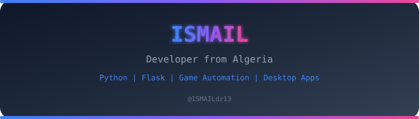

<div align="center">



<!-- Tech Stack Badges -->


<br>


<!-- GitHub Stats -->


</div>

---

## 👋 About Me

```python
class ISMAIL:
    def __init__(self):
        self.name = "ISMAIL"
        self.location = "Algeria"
        self.focus = ["Game Automation", "Desktop Apps", "Web Dashboards"]
        self.languages = ["Python", "JavaScript", "HTML/CSS"]
        self.tools = ["Flask", "CustomTkinter", "SQLite", "Protobuf", "AES-256"]
        self.learning = "Always"
    
    def current_projects(self):
        return [
            "FreeFireLevelBot — Automated level bot with ban detection",
            "FreeFireGameBot — Flask dashboard + TCP communication",
            "ChessAIPro — Minimax chess engine in pure vanilla JS",
            "LibreTranslateStudio — Desktop translation app"
        ]
```

---

## 🚀 Projects

<table>
<tr>
<td width="50%" valign="top">
<h3 align="center">🎮 FreeFireLevelBot</h3>
<p align="center">Automated Free Fire level bot with guest info, ban detection, and Termux CLI</p>
<p align="center">
<a href="https://github.com/ISMAILdz13/FreeFireLevelBot">

</a>
</p>
<p align="center">


</p>
</td>
<td width="50%" valign="top">
<h3 align="center">🤖 FreeFireGameBot</h3>
<p align="center">Free Fire game bot with Flask dashboard, squad management, and TCP communication</p>
<p align="center">
<a href="https://github.com/ISMAILdz13/FreeFireGameBot">

</a>
</p>
<p align="center">


</p>
</td>
</tr>
<tr>
<td width="50%" valign="top">
<h3 align="center">♟️ ChessAIPro</h3>
<p align="center">Interactive chess game with minimax AI (alpha-beta pruning) — pure HTML/CSS/JS, zero dependencies</p>
<p align="center">
<a href="https://github.com/ISMAILdz13/ChessAIPro">

</a>
</p>
<p align="center">


</p>
</td>
<td width="50%" valign="top">
<h3 align="center">🌐 LibreTranslateStudio</h3>
<p align="center">Desktop translation app for .po files with multi-engine MT, translation memory, and plugins</p>
<p align="center">
<a href="https://github.com/ISMAILdz13/LibreTranslateStudio">

</a>
</p>
<p align="center">


</p>
</td>
</tr>
<tr>
<td width="50%" valign="top">
<h3 align="center">🔍 FreeFireGuestChecker</h3>
<p align="center">Free Fire guest account checker — detect banned, blacklisted, and clear accounts</p>
<p align="center">
<a href="https://github.com/ISMAILdz13/FreeFireGuestChecker">

</a>
</p>
<p align="center">


</p>
</td>
<td width="50%" valign="top">
<h3 align="center">📊 Profile</h3>
<p align="center">This profile README — you're looking at it right now</p>
<p align="center">

</p>
</td>
</tr>
</table>

---

<div align="center">

<!-- GitHub streak stats -->


</div>

---

## 🛠️ Tech Stack

<div align="center">

| Category | Technologies |
|----------|------------|
| **Languages** | Python, JavaScript, HTML5, CSS3 |
| **Web** | Flask, Express.js |
| **Desktop** | CustomTkinter, TkinterDnD2 |
| **Databases** | SQLite, PostgreSQL |
| **Security** | AES-256, JWT, Keyring |
| **Networking** | TCP Sockets, Protobuf, HTTP APIs |
| **Tools** | Git, Termux, Docker, Gettext |
| **AI/ML** | Minimax Algorithm, Alpha-Beta Pruning |

</div>

---

## 📫 Connect

<div align="center">

<a href="https://github.com/ISMAILdz13">

</a>
<a href="https://t.me/ISMAILdz13">

</a>

</div>

---

<div align="center">
<sub>⭐ Star my repos if you find them useful</sub>
<br>
<sub>Built with ❤️ in Algeria</sub>
</div>
